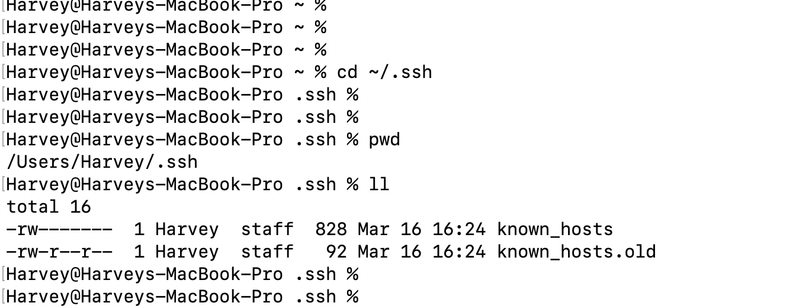
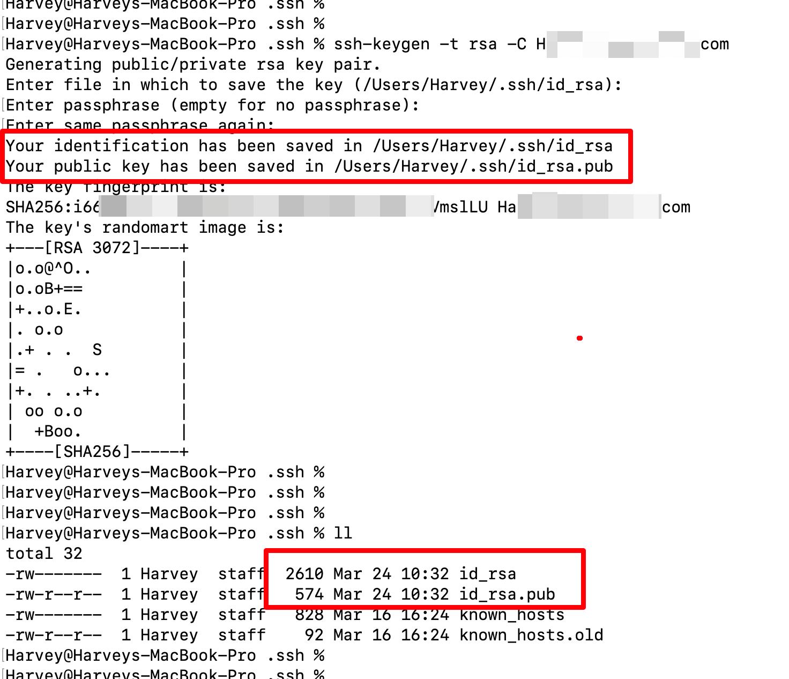
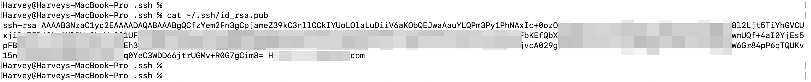
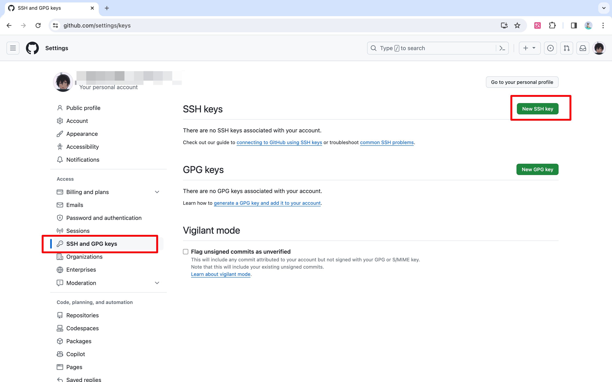
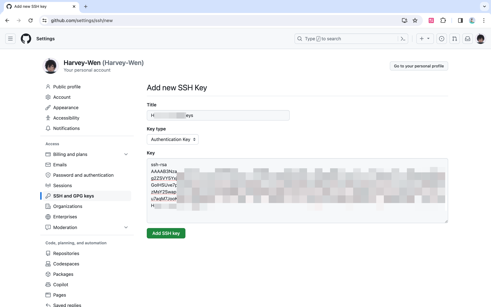

# 02.配置SSH(Secure Shell)

> 使用 HTTPs 协议的 URL 在对远程存储库进行 `git clone`、`git fetch`、`git pull` 或 `git push` 时，每次都要提供用户名和密码。配置好的 SSH 连接则不需要。配置一个身份验证代理 SSH 密钥（即无密码），这样就不必每次使用 SSH 连接时都重新输入密码。

## 生成 SSH Key

1. 首先查看`~/.ssh/` 目录下面是否存在id_rsa.key ，

    

2. 如果不存在可以使用这个命令生产一下`ssh-keygen -t rsa -C "XXXX@gmail.com"`（一路回车，或者设置一个密码），注意这里的 `"XXXX@gmail.com"` 是你登陆git的账户。

    

## 获取 SSH Key

获取到公钥：`cat ~/.ssh/id_rsa.pub`

## 添加 SSH Key：

1. 打开github，然后点击头像找到“setting”，之后找到 “SSH and GPG keys”，点击“New SSH keys”

    

2. 将上一步获取到的公钥添加到这个里面即可。之后你的注册邮箱一般都会收到一个邮件信息告诉你添加了一个ssh。

    

## 测试 SSH Key：

1. 使用一下命令测试一下是否配置成功：`ssh -T git@github.com`

    
