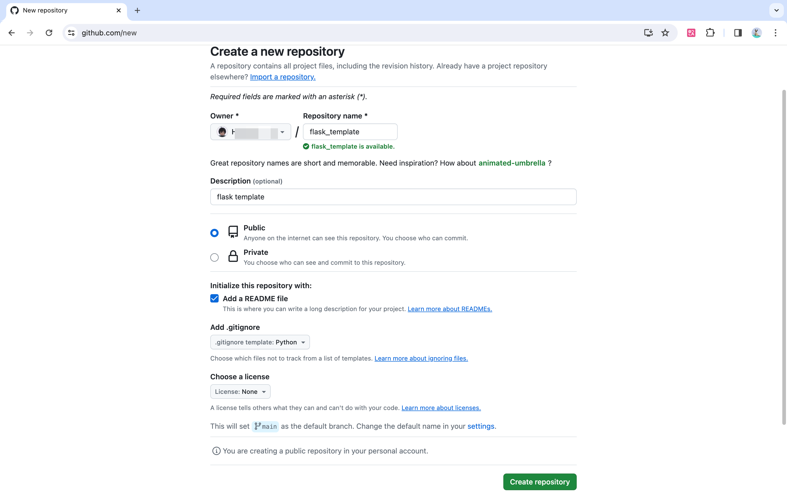

# 01.初始化新项目

## 1.在页面创建项目



## 2.克隆项目

在项目首页，选择“code”，下面的“ssh”复制出 clone的地址。然后在终端中 `git clone git@github.com:xxxxx/flask_template.git `


`git clone git@github.com:xxxxx/flask_template.git`


然后进去到项目目录中，此时初始化一个项目完成了。


## 3.初始化一个完全空项目

```shell
echo "# GitGuide" >> README.md
git init
git add README.md
git commit -m "first commit"
git branch -M main
git remote add origin git@github.com:xxxxxxxxx/GitGuide.git
git push -u origin main
```

