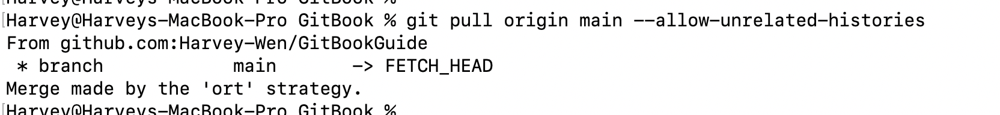

# 02.关联已有项目

## 01. 检查是否已关联

进入项目中，然后`git branch -r` 查看列出所有的远程分支。如果列出的有远程分支，则需要删除才可以关联新的分支。


## 02. 取消关联旧的分支

如果已经关联，建议直接，`rm -rfv .gitignore` 文件，然后重新去生成新的git


## 03. 重新创建git

1. `git init` 初始化
2. `git add .`  添加全部的git文件
3. `git commit -m "init"`


## 04. 关联远程仓库

关联远程仓库：`git remote add origin git@github.com:xxxxx/GitBookGuide.git`

重命名当前分支：`git branch -M main`


## 05. 解决冲突

> 一般情况下，远程新创建的仓库，可能会创建一个 `README.md` , `.gitngore` 文件。而项目中也会存在，所以在提交的时候可能会有冲突。如果没有可以直接略过。

推送：`git push -u origin main`


这个错误提示表示你的推送操作被拒绝，因为远程仓库包含了你本地没有的提交记录。这通常是由于另一个仓库推送到相同的分支引起的。

1. 首先，使用 `git pull` 命令拉取远程仓库的最新变更：`git pull origin main`

2. 如果存在冲突，在合并过程中可能会发生冲突，需要解决这些冲突。Git 会标记出冲突的文件，你需要手动编辑这些文件，解决冲突。

    1. 出现冲突

        

    2. 根据提示，你可以在下次拉取之前运行以下命令来指定协调方式：`git config pull.rebase false` 之后再去执行 `git pull origin main `

    3. 依旧报错：

        

    4. 错误是因为之前两个仓库之间没有共同的提交记录或分支历史。所以执行下面的命令：`git pull origin main --allow-unrelated-histories`

        

3. 一旦解决了冲突，进行提交以完成合并：`git commit -m "Merge remote-tracking branch 'origin/main'"`

4. 最后，再次执行推送操作：`git push -u origin main`


## 06. 错误信息1

> 无共同合并历史：`fatal: refusing to merge unrelated histories`

当你在执行 `git pull origin main` 命令时，出现 "fatal: refusing to merge unrelated histories" 错误提示，这通常是因为你的本地仓库和远程仓库存在不相关的历史记录导致的。

这个错误通常发生在两个仓库之间没有共同的提交记录或分支历史时。为了解决这个问题，你可以尝试使用 `--allow-unrelated-histories` 参数来强制合并不相关的历史记录。

请尝试以下步骤来解决该问题：

1. 使用以下命令拉取远程分支，并添加 `--allow-unrelated-histories` 参数：
   ```shell
   git pull origin main --allow-unrelated-histories
   ```

2. Git 将尝试合并远程分支的历史记录到你的本地分支。

请注意，使用 `--allow-unrelated-histories` 参数可能会导致合并后的历史记录变得混乱，因为没有共同的起点。在执行该命令之前，确保你理解可能出现的后果，并确保没有重要的提交被覆盖或丢失。

如果问题仍然存在或需要进一步帮助，请提供更多详细信息，我将尽力提供支持。


## 07. 错误信息2

> 拉取代码有冲突的时候，选择合并方式。
>
> ```shell
> git pull origin main
> remote: Enumerating objects: 3, done.
> remote: Counting objects: 100% (3/3), done.
> remote: Total 3 (delta 0), reused 0 (delta 0), pack-reused 0
> Unpacking objects: 100% (3/3), 865 bytes | 288.00 KiB/s, done.
> From github.com:Harvey-Wen/GitBookGuide
> 
> branch main -> FETCH_HEAD
> [new branch] main -> origin/main
> hint: You have divergent branches and need to specify how to reconcile them.
> hint: You can do so by running one of the following commands sometime before
> hint: your next pull:
> hint:
> hint: git config pull.rebase false # merge
> hint: git config pull.rebase true # rebase
> hint: git config pull.ff only # fast-forward only
> hint:
> hint: You can replace "git config" with "git config --global" to set a default
> hint: preference for all repositories. You can also pass --rebase, --no-rebase,
> hint: or --ff-only on the command line to override the configured default per
> hint: invocation.
> ```


这个提示表示你的本地分支与远程分支有差异，需要指定如何协调它们。你可以按照以下步骤进行操作：

1. 根据提示，你可以在下次拉取之前运行以下命令来指定协调方式：
   - 如果你想要使用合并（merge）方式：
     ```shell
     git config pull.rebase false
     ```
   - 如果你想要使用变基（rebase）方式：
     ```shell
     git config pull.rebase true
     ```
   - 如果你只想进行快进合并（fast-forward）：
     ```shell
     git config pull.ff only
     ```

   这些命令会设置你的默认协调方式。如果你想要为所有仓库设置默认值，可以在命令中添加 `--global` 参数。

2. 选择合适的协调方式后，再次执行拉取操作：
   ```shell
   git pull origin main
   ```

   Git 将会根据你指定的协调方式进行拉取并尝试协调本地分支与远程分支之间的差异。

请注意，如果你想要在每次拉取时都手动指定协调方式，你可以在命令中添加 `--rebase`、`--no-rebase` 或 `--ff-only` 参数来覆盖默认设置。
