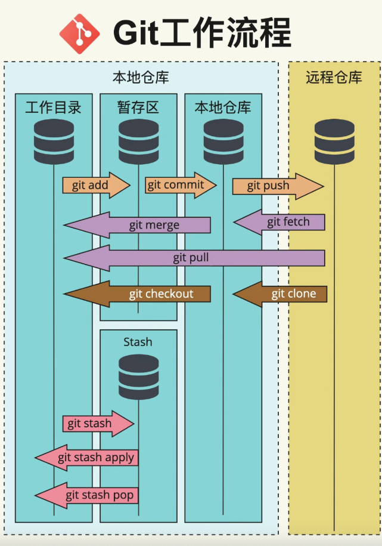

# 04、常用命令表

> 
>
> 基本信息说明
>
> ```shell
> master：默认开发分子
> origin：默认远程版本库
> Head：默认开发分支
> Head^：Head的父提交
> ```
>
> 

## 01.创建版本库

```shell
$ git clone <url>	# 创建远程版本库
$ git init			# 初始化本地版本库
```


## 02.修改和提交

```shell
$ git status		# 查看状态

$ git diff <file>	# 查看变更内容
$ git diff --cached <file>		# 查看暂存区和上一个commit的变化
$ git diff <commit1> <commit2>	# 查看两次提交之间的差异

$ git add .			# 跟踪所有改动过的文件
$ git add <file>	# 跟踪指定改动过的文件
$ git mv <old> <new>	# 文件改名，并且放入暂存区
$ git rm <file>			# 删除文件
$ git rm --cached <file>	# 停止跟踪文件，但是不删除
$ git commit -m "commit message"	# 提交所有更新过的文件，并提交信息
$ git commit --amend	# 修改最后一次提交
```


## 03.检查日志

```shell
$ git log			# 查看提交信息
$ git log -p <file>	# 查看指定文件的提交历史
$ git log --stat
$ git log --oneline
$ git log --graph --decorate
$ git blame <file>	# 以列表方式查看执行文件的提交历史

$ git show <commit>	# 显示某次提交的元数据和内容变化

```


## 04.撤销&重写

```shell
$ git reset --hard HEAD		# 撤销工作目录中所有未提交文件的修改内容
$ git checkout HEAD <file>	# 撤销指定的未提交文件的修改内容
$ git revert <commit>		# 撤销指定的提交
$ git clean -n 		# 显示将从工作目录中删除那些文件，使用-f选项执行clean

$ git rebase <branch>		# 将当前分支重新设置在目标分支branch之上进行变基操作
$ git rebase -i <commit>	# 以交互方式将当前分支重新设置为commit
$ git reflog		# 显示当前分支的最新几次提交
$ git reset --hard <commit>	# 重置当前分支的HEAD为执行commit，同时重置暂存区和工作区一致
```


## 05.分支和标签

```shell
$ git branch					# 显示所有本地分支
$ git checkout <branch/tag>		# 切换到指定分支或者标签
$ git checkout -b <new-branch>	# 创建新分支并切换到新分支
$ git branch <new-branch>		# 创建新分支
$ git branch -d <branch>		# 删除分支
$ git branch -D <branch>		# 强制删除分支
$ git tag					# 列出本地所有标签
$ git tag <tagname>			# 基于最新提交创建标签
$ git tag -d <tagname>		# 删除标签
```


## 06.合并和衍合

```shell
$ git merge <branch>	# 合并指定分支到当前分支
$ git rebase <branch>	# 衍合指定分支到当前分支
```


## 07.远程操作

```shell
$ git remote -v		# 查看远程版本库信息
$ git remote show <remote>		# 查看指定远程版本库信息
$ git remote add <remote> <url>	# 添加远程版本库
$ git fetch <remote>		# 从远程库获取代码的变动
$ git pull <remote> <branch>	# 拉取远程分支代码并快速合并
$ git pull --rebase <remote> 	# 从远程长裤获取最新更改，并将当前分支的本地提交重新应用在获取的更改之上
$ git push <remote> <branch>	# 推送本地分支代码并快速合并
$ git push <remote> :<branch/tag-name>	# 删除远程分支或标签
$ git push --tags <remote>	# 上传所有标签
$ git push --all <remote> 	# 上传所有分支

$ git remote add <name> <url> 新增一个新的远程仓库，并命名
```


## 08.配置信息

```shell
$ git config --list		# 列出本机全部git配置信息
$ git config --global user.name <name>		# 配置提交相关联的名称
$ git config --global user.email <email>	# 配置提交相关联的邮箱地址
$ git config --global --edit	# 在文件编辑器中带啊全局配置文件以便手动修改
```


## 09.工作流程图


